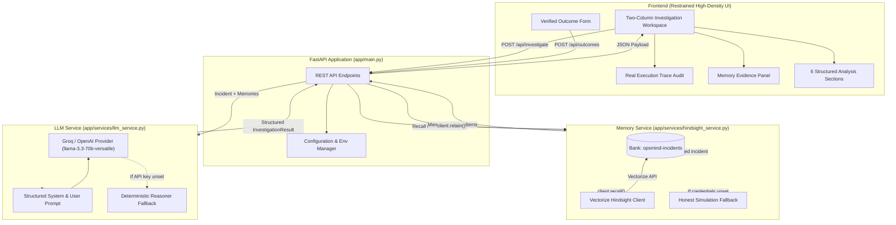

# OpsMind — Memory-Aware Incident Response Assistant

OpsMind is an intelligent incident investigation assistant that integrates persistent memory powered by **Vectorize.io Hindsight** to help site reliability engineers (SREs) and on-call responders diagnose production outages faster, avoid blindly repeating unverified fixes, and retain verified outcomes across incidents.

---

## 1. Problem Statement & Value

### The Incident Response Memory Deficit
When production systems degrade, on-call engineers face intense time pressure. They often lack visibility into prior incident history, resulting in:
1. **Lost Institutional Knowledge**: Symptom patterns, subtle root causes, and telemetry signatures from past outages remain trapped in dispersed Slack threads, closed Jira tickets, or private post-mortems.
2. **Blindly Repeating Flawed Actions**: Responders may re-apply superficial fixes (e.g., restarting containers, increasing thread/connection pools) that previously failed or made the incident worse.
3. **Stateless LLM Pitfalls**: Generic LLMs lack persistent memory of your infrastructure, treat every incident as completely novel, hallucinate unsupported root causes, and fail to differentiate confirmed facts from working hypotheses.

### The OpsMind Solution
OpsMind connects an incident investigation agent with **Vectorize.io Hindsight** to form a closed-loop memory system:
- **Recalls** relevant historical outages and post-mortems with relevance scores and provenance tags.
- **Differentiates** confirmed historical facts from current working hypotheses.
- **Warns** against re-applying fixes that previously backfired.
- **Prescribes** safe, read-only diagnostic checks (no destructive writes or blind restarts).
- **Retains** verified root causes and resolutions into persistent memory, so the entire organization learns from every incident.

---

## 2. Architecture Overview



---

## 3. How Hindsight Is Integrated

OpsMind integrates Vectorize.io's official Python SDK (`hindsight-client`) across three distinct memory dimensions:

### A. Retain (Capturing Verified Operational Truth)
When an incident is resolved, responders record the verified outcome via the **Record Verified Outcome** interface (`POST /api/outcomes`):
- **Structured Schema**: Documents include incident ID, service name, symptoms, confirmed root cause, verified resolution fix, verification status (`VERIFIED` or `UNCONFIRMED`), and observation notes.
- **Document Tags**: Tags such as `service:<name>`, `status:VERIFIED`, and `incident:<id>` enable structured indexing and hybrid search filtering.
- **Idempotency**: Retaining updates existing records in-place without duplicating records.
- **Code Reference**: [`app/services/hindsight_service.py`](file:///c:/Users/aniru/OneDrive/Desktop/OpsMind%20project/app/services/hindsight_service.py) -> `retain_incident()`.

### B. Recall (Context-Aware Retrieval During Outages)
When a new incident is submitted (`POST /api/investigate`):
- **Query Formulation**: The service combines the service name, symptom description, and log excerpt into a semantic query.
- **Targeted Bank Search**: Queries the dedicated `opsmind-incidents` memory bank via `client.recall(bank_id, query)`.
- **Relevance Extraction**: Results are mapped into `MemoryEvidenceItem` objects containing similarity scores, historical verification badges, excerpts, and timestamps.
- **Transparent Provenance**: If no relevant memories exist (e.g. an unseen service), the system reports zero memories, ensuring the LLM does not hallucinate historical precedent.
- **Code Reference**: [`app/services/hindsight_service.py`](file:///c:/Users/aniru/OneDrive/Desktop/OpsMind%20project/app/services/hindsight_service.py) -> `recall_relevant_memories()`.

### C. Reflect & Prevent Repeat Mistakes (LLM Reasoning Integration)
Retrieved memories are fed directly into the LLM system prompt (`app/services/llm_service.py`):
- **Separation of Concerns**: Confirmed historical facts are strictly separated from current unconfirmed symptoms.
- **Negative Guidance**: If a previous incident documented that increasing connection pool size masked an upstream database lock, the agent explicitly warns: *"Do NOT simply increase connection pool size."*
- **Safe Read-Only Checks**: All recommended checks are strictly diagnostic commands (e.g., `pg_stat_activity`, `netstat`, `kubectl logs`, `curl`). Destructive actions (`DROP`, `DELETE`, `kill -9`, restarts) are strictly prohibited.

### D. Honest Simulation Mode
If `HINDSIGHT_API_KEY` is not configured, OpsMind operates in **Simulation Mode**:
- Simulation mode is prominently indicated in the header badge (`Hindsight: Simulation Mode`) and in every retrieved memory tag (`[SIMULATED MEMORY - HINDSIGHT NOT CONFIGURED]`).
- The local store faithfully models retention, recall, and the complete closed-loop learning cycle without fabricating cloud responses.

---

## 4. Setup and Installation

### Prerequisites
- Python 3.10 to Python 3.14 (Verified compatible with Python 3.14.7).
- Git.
- Optional: Vectorize.io API key and Groq API key (for live cloud capabilities).

### Step 1: Clone Repository
```bash
git clone <your-repository-url>
cd opsmind-project
```

### Step 2: Install Dependencies
```bash
pip install -r requirements.txt
```

### Step 3: Configure Environment Variables
Copy the example environment configuration:
```bash
cp .env.example .env
```
Edit `.env` to configure your keys (or leave blank to run in honest simulation mode):
```ini
# Server configuration
OPSMIND_HOST=127.0.0.1
OPSMIND_PORT=8000
OPSMIND_DEBUG=true

# Hindsight (Vectorize.io) Configuration
HINDSIGHT_BASE_URL=https://api.hindsight.vectorize.io
HINDSIGHT_API_KEY=your_hindsight_api_key_here
HINDSIGHT_BANK_ID=opsmind-incidents

# LLM Provider Configuration
GROQ_API_KEY=your_groq_api_key_here
OPSMIND_LLM_MODEL=llama-3.3-70b-versatile
```

### Step 4: Run the Application
```bash
python run.py
```
Open your browser and navigate to:
```
http://127.0.0.1:8000
```

### Step 5: Run Automated Tests
```bash
python -m pytest tests/ -v
```
All 32 test cases across foundation, Hindsight service, LLM service, outcome retention, and deliverables will execute and pass.

---

## 5. 60-Second Judge Demo Script

Follow this step-by-step sequence to deliver a high-impact 60-second hackathon presentation:

| Time | Action | What to Explain to Judges |
| :--- | :--- | :--- |
| **00:00 - 00:15** | **Open App & Seed Baseline** | Show `http://localhost:8000`. Point out the clean Linear/Stripe-inspired interface (zero emojis, tabular numbers, hairline borders). Click **"Seed Baseline"** in the Memory Evidence panel. Trace log confirms baseline incident `INC-2026-0417` (checkout-api connection exhaustion) is seeded into Hindsight. |
| **00:15 - 00:35** | **Scenario A: Memory-Aware Outage** | Select **"Scenario A (checkout-api pool saturation)"** from the scenario dropdown. Click **"Investigate Incident"** (or press `Ctrl+Enter`).<br>• Point to **Memory Evidence**: OpsMind recalled `INC-2026-0417` with relevance reason and verified status.<br>• Point to **Section 4 (Diagnostic Checks)**: Safe read-only commands (`pg_stat_activity`).<br>• Point to **Section 5 (Differences & Uncertainty)**: Highlight the critical warning: *"Do NOT simply increase connection pool size; in INC-2026-0417, increasing pool size without reducing lock timeout caused server thrashing."* Memory prevented a repeat mistake! |
| **00:35 - 00:50** | **Scenario B: Unseen Service** | Select **"Scenario B (notification-worker partition lag)"**. Click **"Investigate Incident"**.<br>• Point to **Memory Evidence**: Correctly shows **0 memories retrieved**.<br>• Explain: OpsMind is honest — it admits it has no prior institutional history for `notification-worker` and treats hypotheses as unverified. |
| **00:50 - 01:00** | **The Learning Loop in Action** | In the **Record Verified Outcome** panel on the left, click **"Sample Outcome"** (pre-fills verified root cause: SMS gateway throttling; fix: async queue + circuit breaker).<br>• Click **"Save Outcome to Hindsight"**.<br>• Trace log confirms the document was retained in memory.<br>• Click **"Investigate Incident"** again.<br>• **Boom!** The Memory Evidence panel now recalls the newly retained outcome! The system permanently learned from this resolution. |

---

## 6. Engineering & Design Rules Adherence

OpsMind was engineered according to the strict constraints set out in [`AGENTS.md`](file:///c:/Users/aniru/OneDrive/Desktop/OpsMind%20project/AGENTS.md):
- **Visual Design**: Restrained light theme (`#FAFAFA` canvas, `#FFFFFF` panels, `#18181B` typography, `#EA580C` accent).
- **Prohibited Effects**: Strictly **zero** purple/indigo/violet/neon cyan/magenta gradients, zero glassmorphism, zero background blobs, and zero decorative AI badges.
- **Strict Radii**: Panel border radius is exactly 6px; button/input border radius is exactly 4px.
- **Typography**: Clean system sans-serif font for UI text; JetBrains Mono with tabular numbers (`font-variant-numeric: tabular-nums`) for technical tokens, timestamps, incident IDs, and metrics.
- **Zero Dead Controls**: Every button, input, shortcut, and dropdown is fully functional and wired to backend endpoints.
- **Truth in Data**: Believable fictional operational data. The system never presents generated hypotheses as confirmed facts, never claims a fix is verified without explicit confirmation, and never disguises mock data as live cloud retrieval.

---

## 7. Hackathon Submission Checklist

- [x] **Working Prototype**: Fully functional full-stack app with FastAPI backend and responsive UI.
- [x] **Hindsight Integration**: Implemented using official `hindsight-client` with Retain, Recall, and Reflect workflows.
- [x] **Verified Outcome Learning Loop**: Live user-triggered retention that updates memory for subsequent investigations.
- [x] **Deterministic & Safe AI Guardrails**: Strict read-only diagnostic suggestions; containment of untrusted logs.
- [x] **Honest Simulation Mode**: Transparent fallback when credentials are not configured.
- [x] **Automated Test Suite**: 32 unit and integration tests passing (`python -m pytest tests/ -v`).
- [x] **Clean Setup & Documentation**: Fully documented installation guide and 60-second judge demo script.
- [x] **Design Rule Compliance**: 100% compliant with `AGENTS.md` visual and interaction standards.

---

## 8. Known Limitations & Security Notes

1. **Safe Read-Only Operations**: OpsMind generates inspection and telemetry diagnostic commands for human review, but never automatically executes shell commands or alters production infrastructure.
2. **Server-Side API Keys**: All provider credentials (`HINDSIGHT_API_KEY`, `GROQ_API_KEY`) are managed strictly server-side via environment variables and are never leaked to the client browser.
3. **Multi-Tenant Bank Isolation**: Current version targets a shared incident memory bank (`opsmind-incidents`). In enterprise production deployments, banks can be segregated by engineering team, environment (`staging`, `production`), or compliance boundary.
